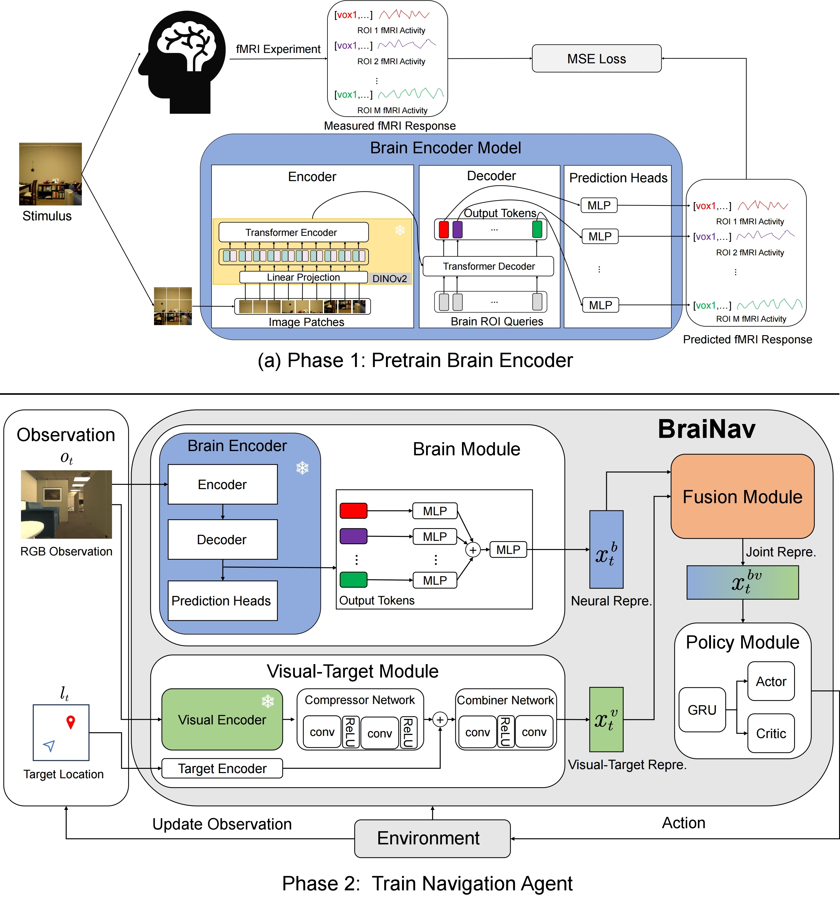
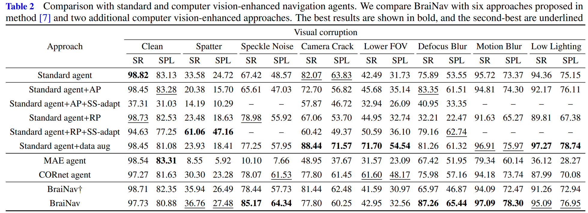

# 🧠 BraiNav: Incorporating Human Brain Activity to Enhance Robustness in Embodied Visual Navigation

Official implementation of the paper:

> **BraiNav: Incorporating Human Brain Activity to Enhance Robustness in Embodied Visual Navigation**  
> *Science China Technological Sciences, 2025*  
> [Daniel Peng](https://github.com/danelpeng) et al.

---

## 🧩 0. Method Overview

BraiNav is a **two-phase Brain-Machine Integration Navigation framework** designed to enhance robustness of embodied navigation agents against visual corruptions by leveraging **human brain activity**.

### 1️⃣ Brain Encoder Pretraining
- A **brain encoder** is first trained on a large-scale human brain activity dataset using a **self-supervised pretrained model**.
- After pretraining, the brain encoder is **frozen** to extract high-level neural representations for downstream navigation tasks.

### 2️⃣ Multimodal Brain-Visual Fusion
- Neural representations from the frozen brain encoder capture **high-level cognitive information**.  
- A **cross-attention based multimodal fusion module** combines visual features from the navigation environment with brain-derived representations to form a **joint brain-visual embedding**.

### 3️⃣ Navigation Policy Learning
- The fused brain-visual embeddings are used to **train a navigation policy**, improving robustness against various visual corruptions.
- Extensive experiments show that BraiNav outperforms standard navigation agents and other vision-enhanced baselines in terms of **success rate, SPL, and robustness**.

### 🧠 Framework Overview

  

### 📈 Main Results

  

> 📊 BraiNav consistently improves navigation robustness under visual degradation scenarios.

---

## ⚙️ 1. Environment Setup
We recommend following the setup style of [ROBUSTNAV](https://github.com/allenai/robustnav).

## 🚀 2. Training and Evaluation

🔧 Training
bash train_navigation_agents.sh

🧪 Evaluation
bash eval_navigation_agents.sh

## 📚 3. Citation

## 🙏 Acknowledgements